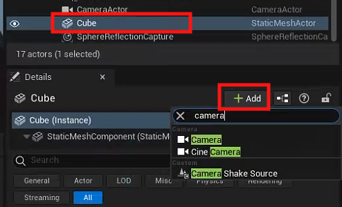
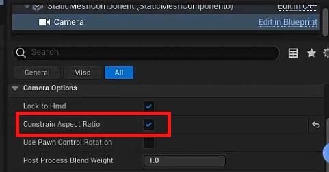

# Camara Control Example

## Place Actor and Add Camara Component

> But this approach can not use pilot mode.




### Contrain Aspect Ratio Settings



### Sample Camera Director Class

header
```cpp
public:	
	// Called every frame
	virtual void Tick(float DeltaTime) override;

	UPROPERTY(EditAnywhere)
		AActor* CameraOne;
	UPROPERTY(EditAnywhere)
		AActor* CameraTwo;
	UPROPERTY(EditAnywhere)
		float TimeToNextCameraChange;
```

source cpp
```cpp

#include <Kismet/GameplayStatics.h>

// Called every frame
void ACameraDirector::Tick( float DeltaTime)
{
	Super::Tick(DeltaTime);

	const float TimeBetweenCameraChanges = 2.0f;
	const float SmoothBlendTime = 0.75f;

	TimeToNextCameraChange -= DeltaTime;
	if ( TimeToNextCameraChange <= 0.0f)
	{
		TimeToNextCameraChange += TimeBetweenCameraChanges;

		APlayerController* controller = UGameplayStatics::GetPlayerController(this, 0);

		if (controller)
		{
			if ((controller->GetViewTarget() != CameraOne) && (CameraOne != nullptr))
			{
				controller->SetViewTarget(CameraOne);
			}
			else if ((controller->GetViewTarget() != CameraTwo) && (CameraTwo != nullptr))
			{
				controller->SetViewTargetWithBlend(CameraTwo, SmoothBlendTime);
			}
		}
	}

}
```


## Add Camera Actor and Use Pilot mode

